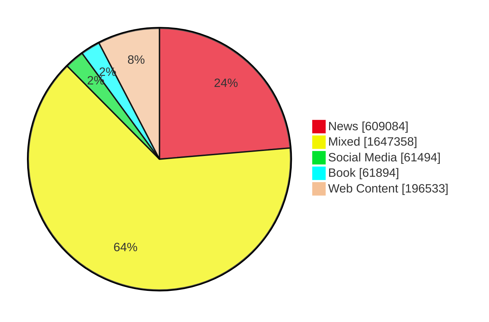

# FLAN Dataset Overview

| Dataset Name                                 | Source                                                                                                                                           | Quantity (row)                       | Task                | Domain       | License                                                                |
| -------------------------------------------- | ------------------------------------------------------------------------------------------------------------------------------------------------ | ------------------------------------ | ------------------- | ------------ | ---------------------------------------------------------------------- |
| ThaiSum                                      | [thaisum](https://huggingface.co/datasets/thaisum)                                                                                               | 359k                                 | Summarization       | News         | [MIT License](https://opensource.org/license/mit)                      |
| scb-mt-en-th-2020                            | [scb_mt_enth_2020](https://huggingface.co/datasets/scb_mt_enth_2020)                                                                             | 1602k (801k enth, 801k then)         | Translation         | Mixed        | [CC BY-SA 4.0](https://creativecommons.org/licenses/by-sa/4.0/deed.en) |
| han-instruct-dataset-v2.0                    | [pythainlp/han-instruct-dataset-v2.0](https://huggingface.co/datasets/pythainlp/han-instruct-dataset-v2.0)                                       | 3.2k                                | Text Generation     | Mixed        | [CC BY-SA 4.0](https://creativecommons.org/licenses/by-sa/4.0/deed.en) |
| xP3x                                         | [CohereForAI/xP3x](https://huggingface.co/datasets/CohereForAI/xP3x)                                                                             | 6k                                   | Other               | Mixed        | [Apache License 2.0](https://choosealicense.com/licenses/apache-2.0/)  |
| Open-Platypus                                | [garage-bAInd/Open-Platypus](https://huggingface.co/datasets/garage-bAInd/Open-Platypus)                                                         | 24.9k                                | Other               | Mixed        | Multiple Licenses                                                      |
| Wisesight Sentiment Corpus                   | [wisesight_sentiment](https://huggingface.co/datasets/wisesight_sentiment)                                                                       | 21.15k                               | Text Classification | Social Media | [CC0-1.0](https://creativecommons.org/publicdomain/zero/1.0/deed.en)   |
| Thai Food Recipe dataset v1.0                | [pythainlp/thai_food_v1.0](https://huggingface.co/datasets/pythainlp/thai_food_v1.0)                                                             | 159                                  | Text Generation     | Book         | [CC0-1.0](https://creativecommons.org/publicdomain/zero/1.0/deed.en)   |
| thai-wiki-dataset-v3                         | [pythainlp/thai-wiki-dataset-v3](https://huggingface.co/datasets/pythainlp/thai-wiki-dataset-v3)                                                 | 197k                                 | Text Generation     | Web Content  | [CC BY-SA 3.0](https://creativecommons.org/licenses/by-sa/3.0/deed.en) |
| klongklon                                    | [pythainlp/klongklon](https://huggingface.co/datasets/pythainlp/klongklon)                                                                       | 57.6k                                | Text Generation     | Book         | [MIT License](https://opensource.org/license/mit)                      |
| Thai Public Investment Consultant (IC) Exams | [openthaigpt/thai-investment-consultant-licensing-exams](https://huggingface.co/datasets/openthaigpt/thai-investment-consultant-licensing-exams) | 266                                  | Question Answering  | Book         | [Apache License 2.0](https://choosealicense.com/licenses/apache-2.0/)  |
| Thai USembassy                               | [pythainlp/thai_usembassy](https://huggingface.co/datasets/pythainlp/thai_usembassy)                                                             | 615                                  | Text Generation     | News         | [CC0-1.0](https://creativecommons.org/publicdomain/zero/1.0/deed.en)   |
| Wongnai Reviews                              | [wongnai_reviews](https://huggingface.co/datasets/wongnai_reviews)                                                                               | 40k                                  | Text Classification | Social Media | [lgpl-3.0](https://www.gnu.org/licenses/lgpl-3.0.html)                 |
| Thai sentiment analysis dataset              | [thai-sentiment-analysis-dataset](https://github.com/PyThaiNLP/thai-sentiment-analysis-dataset)                                                  | 342                                  | Text Classification | Social Media | [CC BY 4.0](https://creativecommons.org/licenses/by/4.0/deed.en)       |
| Thai-English transliteration dictionary      | [thai-english-transliteration-dictionary](https://github.com/wannaphong/thai-english-transliteration-dictionary/)                                | 3868                                 | Translation         | Book         | [CC BY 4.0](https://creativecommons.org/licenses/by/4.0/deed.en)       |
| PRD News 30112023                            | [pythainlp/prd_news_30112023](https://huggingface.co/datasets/pythainlp/prd_news_30112023)                                                       | 243k                                 | Text Generation     | News         | [CC0-1.0](https://creativecommons.org/publicdomain/zero/1.0/deed.en)   |
| Aya Collection                               | [CohereForAI/aya_collection](https://huggingface.co/datasets/CohereForAI/aya_collection)                                                         | 1.17k (1.1k xle_wd, 724 aya_dataset) | Text Generation     | Mixed        | [Apache License 2.0](https://choosealicense.com/licenses/apache-2.0/)  |

This repository provides an overview of a curated collection of datasets designed for natural language processing tasks, with a focus on Thai language applications. These datasets span a range of tasks including Summarization, Translation, Text Generation, Text Classification, and Question Answering. Each dataset is accompanied by its source, size, intended task, and licensing information, making it easy for users to identify and utilize the datasets that best fit their needs. Total row is `2576363`.

## Domains



## Table of contents

<!-- vim-markdown-toc GFM -->

* [Create Dataset](#create-dataset)
* [Datasets](#datasets)
  * [1. ThaiSum](#1-thaisum)
  * [2. scb-mt-en-th-2020](#2-scb-mt-en-th-2020)
  * [3. han-instruct-dataset-v2.0](#3-han-instruct-dataset-v20)
  * [4. xP3x](#4-xp3x)
  * [5. Open-Platypus](#5-open-platypus)
  * [6. Wisesight Sentiment Corpus](#6-wisesight-sentiment-corpus)
  * [7. Thai Food Recipe dataset v1.0](#7-thai-food-recipe-dataset-v10)
  * [8. thai-wiki-dataset-v3](#8-thai-wiki-dataset-v3)
  * [9. klongklon](#9-klongklon)
  * [10. Thai Public Investment Consultant (IC) Exams](#10-thai-public-investment-consultant-ic-exams)
  * [11. Thai USembassy](#11-thai-usembassy)
  * [12. Wongnai Reviews](#12-wongnai-reviews)
  * [13. Thai sentiment analysis dataset](#13-thai-sentiment-analysis-dataset)
  * [14. Thai-English transliteration dictionary](#14-thai-english-transliteration-dictionary)
  * [15. PRD News 30112023](#15-prd-news-30112023)
  * [16. Aya Collection](#16-aya-collection)

<!-- vim-markdown-toc -->

## Create Dataset

config path for dataset creation: `/workspace/flan_dataset/flan` in main.py and run

```python
python main.py
```

## Datasets

---

### 1. ThaiSum

ThaiSum is a large-scale corpus for Thai text summarization obtained from several online news websites namely Thairath, ThaiPBS, Prachathai, and The Standard. This dataset consists of over 350,000 article and summary pairs written by journalists.

- Source: [thaisum](https://huggingface.co/datasets/thaisum)
- Quantity (row): 358868
- Task: summarization
- License: [MIT License](https://opensource.org/license/mit)
- Domain: News

<details close>
  <summary>Example</summary>
  <br>
    <pre lang="python">
    {
    'title': 'คอนเต คนแรกทำสถิติให้ งูใหญ่ สตาร์ทเข้าวินรวด 5 นัด ',
    'body': 'สำนักข่าวต่างประเทศรายงานวันที่ 26 ก.ย. ว่า หลังจากที่ทัพ เนรัซซูรี หรือที่รู้จักกันในชื่อ อินเตอร์ มิลาน เก็บชัยชนะ 5 เกมรวด โดยเกมล่าสุด เมื่อคืนที่ผ่านมา พวกเขาเปิดถิ่น\xa0จูเซปเป เมอัซซา เฉือนเอาชนะ ลาซิโอ 1-0 จากลูกโหม่งของ\xa0ดานิโล ดัมโบรซิโอ ในนาทีที่ 23\xa0,ส่งผลให้งูใหญ่ที่นอกจากจะคว้าชัย 5 เกมรวดแล้ว ยังทำให้ขึ้นไปรั้งเป็นจ่าฝูงของตารางกัลโชอีกด้วย โดยเก็บได้ 15 คะแนนเต็ม ซึ่งทีมที่ตามมาคือ แชมป์เก่า ยูเวนตุส มี 13 คะแนน และอตาลันตา 10 คะแนน\xa0,นอกจากนี้\xa0อันโตนิโอ คอนเต กุนซือดังชาวอิตาเลียน ยังสร้างสถิติ กลายเป็นผู้จัดการทีมคนแรกของอินเตอร์ มิลาน ที่พาทีมเก็บชัยชนะรวดตั้งแต่ 5 เกมแรก ซึ่งเจ้าตัวก็มีดีกรีไม่เบา เคยพาทัพม้าลายเถลิงแชมป์ลีกมาแล้ว 3 ครั้งในฤดูกาล 2011-2012, 2012 -2013 และ 2013-2014 ก่อนจะโดน เสี่ยหมี โรมัน อับราโมวิช เจ้าของทีมเชลซี ชักชวนให้มาคุมทีม และก็สามารถพาเชลซีคว้าแชมป์พรีเมียร์ลีกได้ด้วยในซีซั่น 2017-2018 และคว้าถ้วย เอฟเอ คัพ ในฤดูกาลต่อมา\xa0',
    'summary': 'อันโตนิโอ คอนเต สร้างปรากฏการณ์ให้กับทัพ งูใหญ่ อินเตอร์ มิลาน หลังพาสังกัดคว้าชัย 5 เกมรวด ในช่วงออกสตาร์ตฤดูกาลของศึกกัลโช เซเรียอา อิตาลี ',
    'type': 'กีฬา,ฟุตบอลยุโรป',
    'tags': 'อินเตอร์ มิลาน,อันโตนิโอ คอนเต,กัลโช เซเรีย อา,งูใหญ่,เนรัซซูรี',
    'url': 'https://www.thairath.co.th/sport/eurofootball/otherleague/1669033'
    }</pre>
</details>

---

### 2. scb-mt-en-th-2020

A Large English-Thai Parallel Corpus The primary objective of our work is to build a large-scale English-Thai dataset for machine translation. We construct an English-Thai machine translation dataset with over 1 million segment pairs, curated from various sources, namely news, Wikipedia articles, SMS messages, task-based dialogs, web-crawled data and government documents. Methodology for gathering data, building parallel texts and removing noisy sentence pairs are presented in a reproducible manner.

- Source: [scb_mt_enth_2020](https://huggingface.co/datasets/scb_mt_enth_2020)
- Quantity (row): 1602804
  - enth: 801402
  - then: 801402
- Task: translation
- License: [CC BY-SA 4.0](https://creativecommons.org/licenses/by-sa/4.0/deed.en)
- Domain: Mixed

<details close>
  <summary>Example</summary>
  <br>
    <pre lang="python">
    {
    'translation':
      {
        'en': '(Pictured: A man watches the live-stream transmission of released Indian pilot Wing Cmdr. Abhinandan Varthaman at Wagah border crossing in Punjab on March 1, 2019.)',
        'th': '(ภาพ: ชายคนหนึ่งชมการแพร่ภาพออกอากาศสดการปล่อยตัวนักบินอินเดีย น.ท. อภินันทาน วาร์ธามัน ที่จุดผ่านแดนวาร์กาในรัฐปัญจาบ เมื่อวันที่ 1 มีนาคม พ.ศ. 2562)'
      },
    'subdataset': 'aqdf_corpus'
    }</pre>
</details>

---

### 3. han-instruct-dataset-v2.0

🪿 Han (ห่าน or goose) Instruct Dataset is a Thai instruction dataset by PyThaiNLP. It collect the instruction following in Thai from many source.

- Source: [pythainlp/han-instruct-dataset-v2.0](https://huggingface.co/datasets/pythainlp/han-instruct-dataset-v2.0)
- Quantity (row): 1951
- Task: text generation
- License: [CC BY-SA 4.0](https://creativecommons.org/licenses/by-sa/4.0/deed.en)
- Domain: Mixed

<details close>
  <summary>Example</summary>
  <br>
    <pre lang="python">
    {
    'inputs': 'สงครามยุทธหัตถี เกิดขึ้นเมื่อไรและอย่างไร',
    'targets': 'สงครามยุทธหัตถี เป็นสงครามที่เกิดขึ้นในปี พ.ศ. 2135 ระหว่างกรุงศรีอยุธยากับกรุงหงสาวดี ผลของสงครามครั้งนั้นปรากฏว่าอยุธยาเป็นฝ่ายชนะถึงแม้จะมีกำลังพลน้อยกว่า สงครามครั้งนี้มีความโดดเด่นในการต่อสู้ระหว่างพระนเรศวรกับอุปราชมังกะยอชวา สงครามนี้เป็นการปลดปล่อยสยามจากการครอบครองของพม่าต่อไปเป็นระยะเวลา 175 ปีจนถึง พ.ศ. 2310'
    }</pre>
</details>

---

### 4. xP3x

xP3x (Crosslingual Public Pool of Prompts eXtended) is a collection of prompts & datasets across 277 languages & 16 NLP tasks. It contains all of xP3 + much more! It is used for training future contenders of mT0 & BLOOMZ at project Aya @C4AI

- Source: [CohereForAI/xP3x](https://huggingface.co/datasets/CohereForAI/xP3x)
- Quantity (row): 6027
- Task: other
- License: [Apache License 2.0](https://choosealicense.com/licenses/apache-2.0/)
- Domain: Mixed

<details close>
  <summary>Example</summary>
  <br>
    <pre lang="python">
    {
    'inputs': '"I was moved every time we did a rehearsal on this, from the bottom of my heart." The previous text is in English. Here is a translation to Thai:',
    'targets': 'ผมรู้สึกตื้นตันทุกครั้งที่เราซ้อมเช่นนี้ จากใจจริงเลย',
    'language': 'tha_Thai',
    'split': 'devtest',
    'template': 'continuation-x-x',
    'dataset': 'facebook/flores',
    'config': 'eng_Latn-tha_Thai'
    }</pre>
</details>

---

### 5. Open-Platypus

This dataset is focused on improving LLM logical reasoning skills and was used to train the Platypus2 models. It is comprised of the following datasets, which were filtered using keyword search and then Sentence Transformers to remove questions with a similarity above 80%

- Source: [garage-bAInd/Open-Platypus](https://huggingface.co/datasets/garage-bAInd/Open-Platypus)
- Quantity (row): 24926
- Task: other
- License: [Apache License 2.0](https://choosealicense.com/licenses/apache-2.0/), [CC BY-NC-SA 4.0](https://creativecommons.org/licenses/by-nc-sa/4.0/), [MIT License](https://opensource.org/license/mit), [CC BY 4.0](https://creativecommons.org/licenses/by/4.0/deed.en)
- Domain: Mixed

<details open>
  <summary>Dataset Details</summary>
  <br>
  <table>
    <tr>
      <th>Dataset Name</th>
      <th>License Type</th>
    </tr>
    <tr>
      <td><a href="https://github.com/openai/prm800k">PRM800K</a></td>
      <td><a href="https://opensource.org/license/mit">MIT</a></td>
    </tr>
    <tr>
      <td><a href="https://github.com/hendrycks/math">MATH</a></td>
      <td><a href="https://opensource.org/license/mit">MIT</a></td>
    </tr>
    <tr>
      <td><a href="https://github.com/lupantech/ScienceQA">ScienceQA</a></td>
      <td><a href="https://creativecommons.org/licenses/by-nc-sa/4.0/">CC BY-NC-SA 4.0</a></td>
    </tr>
    <tr>
      <td><a href="https://github.com/mandyyyyii/scibench">SciBench</a></td>
      <td><a href="https://opensource.org/license/mit">MIT</a></td>
    </tr>
    <tr>
      <td><a href="https://huggingface.co/datasets/wenhu/TheoremQA">TheoremQA</a></td>
      <td><a href="https://opensource.org/license/mit">MIT</a></td>
    </tr>
    <tr>
      <td><a href="https://huggingface.co/datasets/TigerResearch/tigerbot-kaggle-leetcodesolutions-en-2k/viewer/TigerResearch--tigerbot-kaggle-leetcodesolutions-en-2k/train?p=2">TigerResearch/tigerbot-kaggle-leetcodesolutions-en-2k</a></td>
      <td><a href="https://choosealicense.com/licenses/apache-2.0/">Apache License 2.0</a></td>
    </tr>
    <tr>
      <td><a href="https://arb.duckai.org/">ARB</a></td>
      <td><a href="https://creativecommons.org/licenses/by/4.0/deed.en">CC BY 4.0</a></td>
    </tr>
    <tr>
      <td><a href="https://huggingface.co/datasets/timdettmers/openassistant-guanaco">timdettmers/openassistant-guanaco</a></td>
      <td><a href="https://choosealicense.com/licenses/apache-2.0/">Apache License 2.0</a></td>
    </tr>
  </table>
</details>

<details close>
  <summary>Example</summary>
  <br>
    <pre lang="python">
    {
    'input': '',
    'output': "There are $\\binom{10}{3}=120$ ways to select exactly three dice to roll 1's ones out of ten dice total. The probability of any one of these outcomes occurring is $\\left(\\dfrac{1}{6}\\right)^3\\left(\\dfrac{5}{6}\\right)^7$ and they're all mutually exclusive cases, so the probability that one of them will occur (which is the probability that we're looking for) is $\\binom{10}{3}\\left(\\dfrac{1}{6}\\right)^3\\left(\\dfrac{5}{6}\\right)^7=\\dfrac{120\\cdot5^7\\cdot1^3}{6^{10}}\\approx .155$.",
    'instruction': 'Ten 6-sided dice are rolled. What is the probability that exactly three of the dice show a 1? Express your answer as a decimal rounded to the nearest thousandth.',
    'data_source': 'MATH/PRM-800K'
    }</pre>
</details>

---

### 6. Wisesight Sentiment Corpus

Wisesight Sentiment Corpus: Social media messages in Thai language with sentiment label (positive, neutral, negative, question)

- Source: [wisesight_sentiment](https://huggingface.co/datasets/wisesight_sentiment)
- Quantity (row): 21152
- Task: text Classification
- License: [CC0-1.0](https://creativecommons.org/publicdomain/zero/1.0/deed.en)
- Domain: Social Media

<details close>
  <summary>Example</summary>
  <br>
    <pre lang="python">
    {
    'texts': 'ไปจองมาแล้วนาจา Mitsubishi Attrage ได้หลังสงกรานต์เลย รอขับอยู่นาจา กระทัดรัด เหมาะกับสาวๆขับรถคนเดียวแบบเรา ราคาสบายกระเป๋า ประหยัดน้ำมัน วิ่งไกลแค่ไหนหายห่วงค่ะ',
    'category': 1
    }</pre>
</details>

---

### 7. Thai Food Recipe dataset v1.0

The Thai Food Recipe dataset is a collection of Thai recipes from old Thai books and social networks.

- Source: [pythainlp/thai_food_v1.0](https://huggingface.co/datasets/pythainlp/thai_food_v1.0)
- Quantity (row): 159
- Task: text generation
- License: [CC0-1.0](https://creativecommons.org/publicdomain/zero/1.0/deed.en)
- Domain: Book

<details close>
  <summary>Example</summary>
  <br>
    <pre lang="python">
    {
    'name': 'กุ้งทาพริกไทยกระเทียม',
    'text': '# กุ้งทาพริกไทยกระเทียม\n## เครื่องปรุง\n\n\n\n- กุ้งนาง 4 ตัว\n\n- พริกไทย 5 เม็ด\n\n- กระเทียมกลีบใหญ่ 2 กลีบ\n\n- รากผักชี 5 ราก\n\n- น้ำปลา 2 ช้อนโต๊ะ\n\n- น้ำมันหมู 1 ช้อนโต๊ะ\n\n\n\n## วิธีทำ\n\n\n\nล้างกุ้งให้สะอาดปอกแล้วผ่าหลังแต่หางตลอดตัวให้ลึก ใช้มีดเบาะบนหลังกุ้งตามขวาง เพื่อให้เอ็นขาดเวลาทอดจะได้ไม่งอ โขลกพริกไทย กระเทียม รากผักชี ให้ละเอียดแล้วเคล้ากุ้งและน้ำปลาให้ทั่ว จึงยกกะทะตั้งไฟ ใส่น้ำมันตั้งให้ร้อนเอากุ้งที่เคล้าไว้ลงทอดพอสุก ตักขึ้นใส่จาน แล้วตักน้ำมันที่ทอดราดหน้ากุ้งด้วย'
    }</pre>
</details>

---

### 8. thai-wiki-dataset-v3

This dataset collects all Thai Wikimedia project that cleaned all text for Thai language. Example: [Wikipedia](https://th.wikipedia.org/) , [Wikiquote](https://th.wikiquote.org/), [Wikibooks](https://th.wikibooks.org/), [Wikisource](https://th.wikisource.org/), and [Wiktionary](https://th.wiktionary.org/).

- Source: [pythainlp/thai-wiki-dataset-v3](https://huggingface.co/datasets/pythainlp/thai-wiki-dataset-v3)
- Quantity (row): 196533
- Task: text generation
- License: [CC BY-SA 3.0](https://creativecommons.org/licenses/by-sa/3.0/deed.en)
- Domain: Web Content

<details close>
  <summary>Example</summary>
  <br>
    <pre lang="python">
    {
    'title': 'โอเพนออฟฟิศดอตอ็อก/การจัดทำสารบัญ',
    'text': 'ในการสร้างหน้าสารบัญ (Table of Contents) โปรแกรมจะดึงเอาส่วนของข้อความที่เรากำหนดสไตล์ไว้มาเป็นสารบัญให้โดยอัตโนมัติ โดยก่อนอื่นเราจะต้องไปกำหนดสไตล์นี้ในเอกสารของเราก่อน จากนั้นจึงสั่งให้โปรแกรมสร้างหน้าสารบัญได้\nกำหนดสไตล์ในเอกสาร\nกำหนดสไตล์ในเอกสาร.\nสไตล์คือรูปแบบย่อหน้าสำเร็จรูปที่เรานำมาใช้ในเอกสารของเราได้ ซึ่งในการสร้างสารบัญนั้นโปรแกรม Writer จะดึงหัวข้อต่างๆ ในเอกสารที่ได้ถูกกำหนดสไตล์ไว้มาเป็นสารบัญโดยอัตโนมัติ\nสำหรับการกำหนดสไตล์ให้กับหัวข้อต่างๆ ในเอกสารทำได้ ดังนี้\nปรับสไตล์ย่อหน้า\nปรับสไตล์ย่อหน้า.\nเราปรับแต่งสไตล์ย่อหน้าได้โดยคลิกขวาชื่อสไตล์ที่ต้องการปรับในหน้าต่าง Style and Formatting เลือก Modify จะปรากฏหน้าต่าง Paragraph Style ซึ่งมีแท็บต่างๆ ให้เรากำหนดได้ ดังตัวอย่างที่แท็บ Font เรากำหนดรูปแบบตัวอักษรสำหรับภาษาอังกฤษ (Western text font) และภาษาไทย (CTL font) ใหม่ ดังรูป ซึ่งจะมีผลกับหน้าเอกสารที่เรากำหนดสไตล์นี้ไว้\nสร้างหน้าสารบัญ\nสร้างหน้าสารบัญ.\nหลังจากที่เราได้กำหนดสไตล์ให้กับหัวข้อต่างๆ ในเอกสารแล้ว ต่อไปเราจะสร้างหน้าสารบัญ ดังนี้\n\nคลิกตำแหน่งในเอกสารที่เราต้องการแทรกหน้าสารบัญ\nเลือก Insert>Indexes and Tables>Indexes and Tables (แทรก> ดัชนีและตาราง>ดัชนีและตาราง)\nที่ Type เลือก Table of Contents เพื่อสร้างหน้าสารบัญ\nคลิกปุ่ม เราก็จะได้หน้าสารบัญตามที่กำหนด\n\nเมื่อใดที่มีการแก้ไขหน้าสารบัญ ให้คลิกขวาที่บริเวณหน้าดัชนี และเลือก\nUpdate Index/Table ปรับปรุงหน้าสารบัญนี้ใหม่\nEdit Index/Table เปิดหน้าต่าง Insert Index/Table สำหรับแก้ไขรายละเอียดเกี่ยวกับหน้าสารบัญนี้\nDelete Index/Table ลบหน้าสารบัญนี้\nสารบัญ\n\nโอเพนออฟฟิศดอตอ็อก\nโอเพนออฟฟิศดอตอ็อก/Calc ทำอะไรได้บ้าง\nโอเพนออฟฟิศดอตอ็อก/กรองข้อมูลอัตโนมัติ เพื่อคัดเลือกข้อมูล\nโอเพนออฟฟิศดอตอ็อก/กราฟกับการนำเสนองาน\nโอเพนออฟฟิศดอตอ็อก/การกรอกข้อความโดยอัตโนมัติด้วย AutoText\nโอเพนออฟฟิศดอตอ็อก/การกรอกข้อมูลและการเลื่อนเคอร์เซอร์\nโอเพนออฟฟิศดอตอ็อก/การกำหนด Margin ให้หน้ากระดาษ\nโอเพนออฟฟิศดอตอ็อก/การกำหนดตำแหน่งแท็บหยุด\nโอเพนออฟฟิศดอตอ็อก/การกำหนดฟอนต์เริ่มต้นให้กับเอกสาร\nโอเพนออฟฟิศดอตอ็อก/การแก้ไขข้อความ\nโอเพนออฟฟิศดอตอ็อก/การแก้ไขฟังก์ชั่น\nโอเพนออฟฟิศดอตอ็อก/การแก้ไขและปรับเปลี่ยนชุดข้อมูลที่ใช้สร้างแผนภูมิ\nโอเพนออฟฟิศดอตอ็อก/การแก้ไขสูตรคำนวณ\nโอเพนออฟฟิศดอตอ็อก/การขีดเส้นตาราง\nโอเพนออฟฟิศดอตอ็อก/การเข้าสู่โปรแกรม OpenOffice.org Writer\nโอเพนออฟฟิศดอตอ็อก/การเขียนฟังก์ชั่น\nโอเพนออฟฟิศดอตอ็อก/การเขียนสมการคณิตศาสตร์\nโอเพนออฟฟิศดอตอ็อก/การค้นหาข้อมูลในตาราง\nโอเพนออฟฟิศดอตอ็อก/การค้นหาและแทนที่ข้อความในเอกสาร\nโอเพนออฟฟิศดอตอ็อก/การค้นหาสิ่งต่างๆ ในเอกสารด้วย Navigation\nโอเพนออฟฟิศดอตอ็อก/การคัดลอกข้อความ\nโอเพนออฟฟิศดอตอ็อก/การคัดลอกข้อมูลในเซลล์\nโอเพนออฟฟิศดอตอ็อก/การคัดลอกวัตถุ\nโอเพนออฟฟิศดอตอ็อก/การคำนวณค่าในตาราง\nโอเพนออฟฟิศดอตอ็อก/การจัดกลุ่มและการจัดเรียงวัตถุ\nโอเพนออฟฟิศดอตอ็อก/การจัดการกับวัตถุ\nโอเพนออฟฟิศดอตอ็อก/การจัดการรูปภาพ\nโอเพนออฟฟิศดอตอ็อก/การจัดข้อความให้อยู่กึ่งกลาง ชิดซ้ายหรือชิดขวาในเอกสาร\nโอเพนออฟฟิศดอตอ็อก/การจัดตำแหน่งวัตถุ\nโอเพนออฟฟิศดอตอ็อก/การจัดทำสารบัญ\nโอเพนออฟฟิศดอตอ็อก/การจัดแนวการวางของข้อความในตาราง\nโอเพนออฟฟิศดอตอ็อก/การจัดเรียงข้อความในมุมมอง Outline\nโอเพนออฟฟิศดอตอ็อก/การจัดเรียงวัตถุ\nโอเพนออฟฟิศดอตอ็อก/การใช้ AutoFormat ตกแต่งตารางโดยอัตโนมัติ\nโอเพนออฟฟิศดอตอ็อก/การใช้ Autosum\nโอเพนออฟฟิศดอตอ็อก/การใช้ Bookmark และการอ้างอิงโยง\nโอเพนออฟฟิศดอตอ็อก/การใช้คำสั่ง Undo เพื่อยกเลิกข้อผิดพลาด\nโอเพนออฟฟิศดอตอ็อก/การใช้คำสั่ง Undo เพื่อยกเลิกสิ่งที่ทำผิดพลาด\nโอเพนออฟฟิศดอตอ็อก/การใช้คำสั่ง Undo และ Redo\nโอเพนออฟฟิศดอตอ็อก/การใช้งาน OpenOffice.org แทน Microsoft Office\nโอเพนออฟฟิศดอตอ็อก/การใช้แผนภูมิ\nโอเพนออฟฟิศดอตอ็อก/การใช้ฟังก์ชั่นนำร่องอัตโนมัติสร้างฟังก์ชั่นที่ต้องการ\nโอเพนออฟฟิศดอตอ็อก/การใช้ภาพประกอบข้อมูล\nโอเพนออฟฟิศดอตอ็อก/การใช้มุมมองต่างๆ ใน Writer\nโอเพนออฟฟิศดอตอ็อก/การใช้สไตล์ย่อหน้า\nโอเพนออฟฟิศดอตอ็อก/การใช้สูตรกับข้อมูลที่อยู่ต่างแผ่นงานและสมุดงาน\nโอเพนออฟฟิศดอตอ็อก/การดัดแปลงวัตถุ\nโอเพนออฟฟิศดอตอ็อก/การตกแต่งกราฟ\nโอเพนออฟฟิศดอตอ็อก/การตกแต่งตารางข้อมูล\nโอเพนออฟฟิศดอตอ็อก/การตกแต่งตารางด้วย AutoFormat\nโอเพนออฟฟิศดอตอ็อก/การตกแต่งสีภาพ\nโอเพนออฟฟิศดอตอ็อก/การตรึงแถวหรือคอลัมน์\nโอเพนออฟฟิศดอตอ็อก/การตั้งกั้นหน้าและกั้นหลัง\nโอเพนออฟฟิศดอตอ็อก/การตั้งเวลาในการบรรยายสไลด์\nโอเพนออฟฟิศดอตอ็อก/การตัดภาพให้เหลือเฉพาะส่วนที่ต้องการ\nโอเพนออฟฟิศดอตอ็อก/การติดตั้ง OpenOffice.org\nโอเพนออฟฟิศดอตอ็อก/การทำดัชนี\nโอเพนออฟฟิศดอตอ็อก/การแทรกข้อความ และการลบข้อความ\nโอเพนออฟฟิศดอตอ็อก/การแทรกข้อมูล\nโอเพนออฟฟิศดอตอ็อก/การแทรกข้อมูลบางเซลล์\nโอเพนออฟฟิศดอตอ็อก/การแทรกภาพลงในสไลด์\nโอเพนออฟฟิศดอตอ็อก/การแทรกภาพลงบนเอกสาร\nโอเพนออฟฟิศดอตอ็อก/การแทรกสไลด์ด้วยการคัดลอกสไลด์\nโอเพนออฟฟิศดอตอ็อก/การนำเข้าตารางจากฐานข้อมูลอื่น\nโอเพนออฟฟิศดอตอ็อก/การนำสูตรไปใช้ในงานเอกสาร\nโอเพนออฟฟิศดอตอ็อก/การนำเสนองาน\nโอเพนออฟฟิศดอตอ็อก/การนำเสนองานด้วยภาพ\nโอเพนออฟฟิศดอตอ็อก/การบันทึกเอกสาร\nโอเพนออฟฟิศดอตอ็อก/การบันทึกเอกสารเป็น PDF\nโอเพนออฟฟิศดอตอ็อก/การแบ่งเนื้อหาเอกสารโดยการขึ้นหน้าใหม่\nโอเพนออฟฟิศดอตอ็อก/การปรับขนาดของตาราง\nโอเพนออฟฟิศดอตอ็อก/การปรับขนาดวัตถุ\nโอเพนออฟฟิศดอตอ็อก/การปรับข้อมูลให้ชิดด้านบน กึ่งกลาง หรือด้านล่างช่องตาราง\nโอเพนออฟฟิศดอตอ็อก/การปรับความสว่างและความคมชัดของภาพ\nโอเพนออฟฟิศดอตอ็อก/การปรับแต่งภาพ\nโอเพนออฟฟิศดอตอ็อก/การปรับแต่งรายละเอียดต่างๆ ของแผนภูมิ\nโอเพนออฟฟิศดอตอ็อก/การปรับแต่งโหมดกราฟิก\nโอเพนออฟฟิศดอตอ็อก/การปรับเปลี่ยนลำดับสไลด์/หัวข้อ\nโอเพนออฟฟิศดอตอ็อก/การปิดเอกสาร\nโอเพนออฟฟิศดอตอ็อก/การเปลี่ยนขนาดฟอนต์\nโอเพนออฟฟิศดอตอ็อก/การเปลี่ยนชนิดและรูปแบบแผนภูมิ\nโอเพนออฟฟิศดอตอ็อก/การเปลี่ยนพื้นหลังเฉพาะพื้นที่วัตถุ\nโอเพนออฟฟิศดอตอ็อก/การเปลี่ยนพื้นหลังสไลด์\nโอเพนออฟฟิศดอตอ็อก/การเปิดเอกสารที่บันทึกไว้กลับมาใช้งาน\nโอเพนออฟฟิศดอตอ็อก/การผสานช่องเซลล์และการแยกช่องเซลล์ในตาราง\nโอเพนออฟฟิศดอตอ็อก/การพิมพ์ข้อความเบื้องต้น\nโอเพนออฟฟิศดอตอ็อก/การพิมพ์งาน\nโอเพนออฟฟิศดอตอ็อก/การพิมพ์ซองจดหมาย\nโอเพนออฟฟิศดอตอ็อก/การพิมพ์เอกสาร\nโอเพนออฟฟิศดอตอ็อก/การเพิ่มแถวและคอลัมน์\nโอเพนออฟฟิศดอตอ็อก/การเพิ่มลูกเล่นในการนำเสนอในสไลด์\nโอเพนออฟฟิศดอตอ็อก/การเพิ่มและลบแถว\nโอเพนออฟฟิศดอตอ็อก/การย่อ/ขยายมุมมอง\nโอเพนออฟฟิศดอตอ็อก/การย้ายข้อความ\nโอเพนออฟฟิศดอตอ็อก/การย้ายข้อมูลในเซลล์\nโอเพนออฟฟิศดอตอ็อก/การย้ายตำแหน่งกล่องข้อความ\nโอเพนออฟฟิศดอตอ็อก/การย้ายและคัดลอกสูตรคำนวณ\nโอเพนออฟฟิศดอตอ็อก/การรวมกลุ่มและแยกวัตถุ\nโอเพนออฟฟิศดอตอ็อก/การเรียงข้อมูลในตาราง\nโอเพนออฟฟิศดอตอ็อก/การเรียงลำดับข้อมูลในตาราง\nโอเพนออฟฟิศดอตอ็อก/การลบข้อความ\nโอเพนออฟฟิศดอตอ็อก/การลบข้อมูลในเซลล์\nโอเพนออฟฟิศดอตอ็อก/การลบแถวหรือลบคอลัมน์\nโอเพนออฟฟิศดอตอ็อก/การลบสไลด์\nโอเพนออฟฟิศดอตอ็อก/การลบสไลด์/หัวข้อ\nโอเพนออฟฟิศดอตอ็อก/การเลือกข้อความและการทำงานกับกล่องข้อความ\nโอเพนออฟฟิศดอตอ็อก/การเลือกเซลล์ แถว หรือคอลัมน์\nโอเพนออฟฟิศดอตอ็อก/การเลือกเซลล์หรือกลุ่มเซลล์\nโอเพนออฟฟิศดอตอ็อก/การเลือกตัวอักษรหรือข้อความบางส่วน\nโอเพนออฟฟิศดอตอ็อก/การเลือกฟอนต์ที่ใช้\nโอเพนออฟฟิศดอตอ็อก/การเลือกวัตถุ\nโอเพนออฟฟิศดอตอ็อก/การเลื่อนดูเอกสาร\nโอเพนออฟฟิศดอตอ็อก/การวาดรูปร่างอัตโนมัติ\nโอเพนออฟฟิศดอตอ็อก/การวาดรูปอิสระ Freeform\nโอเพนออฟฟิศดอตอ็อก/การวาดสี่เหลี่ยมหรือวงกลม\nโอเพนออฟฟิศดอตอ็อก/การวาดเส้นเชื่อม\nโอเพนออฟฟิศดอตอ็อก/การวาดเส้นที่มีหัวลูกศร\nโอเพนออฟฟิศดอตอ็อก/การวาดเส้นลูกศร\nโอเพนออฟฟิศดอตอ็อก/การวาดเส้นและลูกศร\nโอเพนออฟฟิศดอตอ็อก/การสร้างกราฟ\nโอเพนออฟฟิศดอตอ็อก/การสร้างข้อความ\nโอเพนออฟฟิศดอตอ็อก/การสร้างงานพรีเซนเตชั่นชิ้นใหม่\nโอเพนออฟฟิศดอตอ็อก/การสร้างจดหมาย\nโอเพนออฟฟิศดอตอ็อก/การสร้างตัวเชื่อมต่อ\nโอเพนออฟฟิศดอตอ็อก/การสร้างตารางข้อมูล\nโอเพนออฟฟิศดอตอ็อก/การสร้างตารางและฟิลด์\nโอเพนออฟฟิศดอตอ็อก/การสร้างบันทึกย่อ\nโอเพนออฟฟิศดอตอ็อก/การสร้างสรุปภาพนิ่ง\nโอเพนออฟฟิศดอตอ็อก/การสร้างเอกสารใหม่\nโอเพนออฟฟิศดอตอ็อก/การแสดงงานพรีเซนเตชั่น\nโอเพนออฟฟิศดอตอ็อก/การใส่ข้อความในหัวกระดาษ และท้ายกระดาษ\nโอเพนออฟฟิศดอตอ็อก/การใส่ข้อความลงในสไลด์\nโอเพนออฟฟิศดอตอ็อก/การใส่ข้อมูลในตาราง\nโอเพนออฟฟิศดอตอ็อก/การใส่เชิงอรรถ\nโอเพนออฟฟิศดอตอ็อก/การใส่ลำดับเลขหน้า\nโอเพนออฟฟิศดอตอ็อก/การใส่สัญลักษณ์พิเศษอื่นๆ\nโอเพนออฟฟิศดอตอ็อก/การหมุนวัตถุ\nโอเพนออฟฟิศดอตอ็อก/การออกจากโปรแกรม OpenOffice.org Writer\nโอเพนออฟฟิศดอตอ็อก/การออกแบบระบบฐานข้อมูล\nโอเพนออฟฟิศดอตอ็อก/การอ้างอิงเซลล์ในสูตรคำนวณโดยใช้ชื่อหัวคอลัมน์\nโอเพนออฟฟิศดอตอ็อก/กำหนดการใช้งาน OpenOffice.org สำหรับภาษาไทย\nโอเพนออฟฟิศดอตอ็อก/กำหนดข้อความที่แสดงเป็นตัวหนา ตัวเอียง และขีดเส้นใต้\nโอเพนออฟฟิศดอตอ็อก/กำหนดข้อความเป็นตัวหนา-ตัวเอนและขีดเส้น\nโอเพนออฟฟิศดอตอ็อก/กำหนดข้อมูลให้แสดงเป็นตัวหนา ตัวเอน และขีดเส้นใต้\nโอเพนออฟฟิศดอตอ็อก/กำหนดคุณสมบัติวัตถุ\nโอเพนออฟฟิศดอตอ็อก/กำหนดชื่อกลุ่มเซลล์และนำมาใช้ในสูตร\nโอเพนออฟฟิศดอตอ็อก/กำหนดชื่อเรื่องของสไลด์\nโอเพนออฟฟิศดอตอ็อก/กำหนดรายละเอียดเกี่ยวกับการพิมพ์\nโอเพนออฟฟิศดอตอ็อก/กำหนดรูปแบบการแสดงข้อมูล\nโอเพนออฟฟิศดอตอ็อก/กำหนดรูปแบบการแสดงข้อมูลตามเงื่อนไข\nโอเพนออฟฟิศดอตอ็อก/กำหนดรูปแบบการแสดงตัวเลข\nโอเพนออฟฟิศดอตอ็อก/กำหนดรูปแบบการแสดงตัวเลขอย่างเจาะจง\nโอเพนออฟฟิศดอตอ็อก/กำหนดรูปแบบการแสดงวันที่และเวลา\nโอเพนออฟฟิศดอตอ็อก/กำหนดรูปแบบและขนาดตัวอักษรที่แสดงในตาราง\nโอเพนออฟฟิศดอตอ็อก/กำหนดรูปแบบและขนาดตัวอักษรให้กับข้อความในสไลด์\nโอเพนออฟฟิศดอตอ็อก/กำหนดรูปแบบหน้ากระดาษก่อนเริ่มทำงาน\nโอเพนออฟฟิศดอตอ็อก/กำหนดให้ OpenOffice.org เซฟไฟล์งานอัตโนมัติ\nโอเพนออฟฟิศดอตอ็อก/แก้ไขข้อมูลในแผนภูมิที่สร้าง\nโอเพนออฟฟิศดอตอ็อก/แก้ไขคำที่พิมพ์ผิดโดยอัตโนมัติด้วย AutoCorrect\nโอเพนออฟฟิศดอตอ็อก/ขอความช่วยเหลือใน OpenOffice.org\nโอเพนออฟฟิศดอตอ็อก/ขอดูผลลัพธ์การคำนวณบนหน้าจอด้วย Auto Calculate\nโอเพนออฟฟิศดอตอ็อก/ข้อผิดพลาดที่เกิดจากการเขียนสูตรและฟังก์ชั่นผิด\nโอเพนออฟฟิศดอตอ็อก/เข้าใจการใช้สูตรคำนวณ\nโอเพนออฟฟิศดอตอ็อก/เข้าใจระบบฐานข้อมูลเชิงสัมพันธ์\nโอเพนออฟฟิศดอตอ็อก/เข้าใจรูปแบบการจัดเก็บข้อมูลใน Calc\nโอเพนออฟฟิศดอตอ็อก/เข้าใช้งานโปรแกรม Calc\nโอเพนออฟฟิศดอตอ็อก/เข้าสู่โปรแกรม Draw\nโอเพนออฟฟิศดอตอ็อก/คัดลอก/การย้ายแผ่นงานข้ามสมุดงาน\nโอเพนออฟฟิศดอตอ็อก/คัดลอกสูตรอย่างรวดเร็วด้วย AutoFill\nโอเพนออฟฟิศดอตอ็อก/คู่มือติดตั้ง OpenOffice.org 2.0\nโอเพนออฟฟิศดอตอ็อก/เครื่องมือวาดรูปทรงสามมิติ\nโอเพนออฟฟิศดอตอ็อก/เครื่องมือวาดสี่เหลี่ยมและรูปทรงอิสระ\nโอเพนออฟฟิศดอตอ็อก/เครื่องมือวาดเส้น\nโอเพนออฟฟิศดอตอ็อก/เคลื่อนย้าย เปลี่ยนขนาด และลบรูปแผนภูมิ\nโอเพนออฟฟิศดอตอ็อก/เคลื่อนย้ายสไลด์ไปในตำแหน่งที่ต้องการ\nโอเพนออฟฟิศดอตอ็อก/งานพรีเซนเตชั่นกับการพิมพ์\nโอเพนออฟฟิศดอตอ็อก/จบการใช้ AutoFilter\nโอเพนออฟฟิศดอตอ็อก/จัดข้อความให้อยู่กึ่งกลางชิดซ้ายหรือชิดขวา\nโอเพนออฟฟิศดอตอ็อก/จัดตำแหน่งข้อมูลในแต่ละเซลล์\nโอเพนออฟฟิศดอตอ็อก/จัดวางข้อความให้ล้อมภาพในเอกสาร\nโอเพนออฟฟิศดอตอ็อก/จัดวางข้อมูลให้อยู่กึ่งกลางแถวเพื่อใช้เป็นหัวเรื่อง\nโอเพนออฟฟิศดอตอ็อก/ชนิดของความสัมพันธ์ (Relationships)\nโอเพนออฟฟิศดอตอ็อก/ชนิดของคีย์ในฐานข้อมูลเชิงสัมพันธ์\nโอเพนออฟฟิศดอตอ็อก/ช่องตารางหรือเซลล์ใน Calc\nโอเพนออฟฟิศดอตอ็อก/ใช้เมาส์อ้างอิงเซลล์ข้ามแผ่นงาน หรือสมุด\nโอเพนออฟฟิศดอตอ็อก/ใช้เส้นไกด์ช่วยในการวาดภาพ\nโอเพนออฟฟิศดอตอ็อก/ดูข้อมูลในแผ่นงานแบบเต็มจอ\nโอเพนออฟฟิศดอตอ็อก/ตกแต่งข้อความด้วยสี\nโอเพนออฟฟิศดอตอ็อก/ตกแต่งข้อความโดยการใช้สี\nโอเพนออฟฟิศดอตอ็อก/ตกแต่งข้อมูลโดยการใช้สี\nโอเพนออฟฟิศดอตอ็อก/ตรวจสอบการสะกดคำด้วย Spellcheck\nโอเพนออฟฟิศดอตอ็อก/ตรวจสอบงานก่อนพิมพ์\nโอเพนออฟฟิศดอตอ็อก/ตรวจสอบเอกสารก่อนพิมพ์ด้วย Page Preview\nโอเพนออฟฟิศดอตอ็อก/ตั้งชื่อเซลล์หรือกลุ่มเซลล์ที่ต้องใช้บ่อย\nโอเพนออฟฟิศดอตอ็อก/ตั้งชื่อแผ่นงาน\nโอเพนออฟฟิศดอตอ็อก/แถบเครื่องมือวาดรูป\nโอเพนออฟฟิศดอตอ็อก/ทำไมต้องใช้สูตร\nโอเพนออฟฟิศดอตอ็อก/เทคนิคการเปลี่ยนแผ่นสไลด์\nโอเพนออฟฟิศดอตอ็อก/เทคนิคเกี่ยวกับแผนภูมิเพิ่มเติม\nโอเพนออฟฟิศดอตอ็อก/แทรกแผ่นงานเพิ่ม\nโอเพนออฟฟิศดอตอ็อก/แทรกไฟล์ภาพกราฟิก\nโอเพนออฟฟิศดอตอ็อก/แทรกสไลด์แผ่นใหม่\nโอเพนออฟฟิศดอตอ็อก/แทรกอักษรศิลป์\nโอเพนออฟฟิศดอตอ็อก/นับจำนวนคำและตัวอักษรในเอกสาร\nโอเพนออฟฟิศดอตอ็อก/แนวทางเตรียมการนำเสนองานพรีเซนเตชั่น\nโอเพนออฟฟิศดอตอ็อก/แนะนำโปรแกรม Base\nโอเพนออฟฟิศดอตอ็อก/แนะนำฟังก์ชั่นที่สำคัญ\nโอเพนออฟฟิศดอตอ็อก/แนะนำส่วนประกอบของฟังก์ชั่น\nโอเพนออฟฟิศดอตอ็อก/บันทึกงานพรีเซนเตชั่นที่สร้าง\nโอเพนออฟฟิศดอตอ็อก/บันทึกชิ้นงาน\nโอเพนออฟฟิศดอตอ็อก/บันทึกไฟล์ข้อมูล\nโอเพนออฟฟิศดอตอ็อก/บันทึกไฟล์ข้อมูลเป็นไฟล์ Microsoft Excel\nโอเพนออฟฟิศดอตอ็อก/แบ่งข้อความในเอกสารเป็นหลายคอลัมน์\nโอเพนออฟฟิศดอตอ็อก/แบ่งหน้าจอ เพื่อดูข้อมูลที่มีปริมาณมาก\nโอเพนออฟฟิศดอตอ็อก/ใบปะหน้าแฟกซ์\nโอเพนออฟฟิศดอตอ็อก/ปรับความกว้างคอลัมน์และความสูงของแถว\nโอเพนออฟฟิศดอตอ็อก/ปรับแต่งการจัดวางข้อความในย่อ\nโอเพนออฟฟิศดอตอ็อก/ปรับแต่งภาพที่แสดงโดยใช้แถบเครื่องมือรูปภาพ\nโอเพนออฟฟิศดอตอ็อก/ปรับแต่งรูปแบบตัวอักษรเพิ่มเติม\nโอเพนออฟฟิศดอตอ็อก/ปรับพื้นหลังของภาพให้โปร่งใส\nโอเพนออฟฟิศดอตอ็อก/ป้อนสูตรคำนวณ\nโอเพนออฟฟิศดอตอ็อก/เปลี่ยนแถบเมนูจากอังกฤษเป็นไทย\nโอเพนออฟฟิศดอตอ็อก/เปลี่ยนพื้นหลังสไลด์ทั้งแผ่น\nโอเพนออฟฟิศดอตอ็อก/เปิดดูหลายสมุดงานบนหน้าจอในเวลาเดียวกัน\nโอเพนออฟฟิศดอตอ็อก/เปิดโปรแกรม Math\nโอเพนออฟฟิศดอตอ็อก/โปรแกรม Impress\nโอเพนออฟฟิศดอตอ็อก/โปรแกรม Writer ทำอะไรได้บ้าง\nโอเพนออฟฟิศดอตอ็อก/ผลิตภัณฑ์ในชุด OpenOffice.org\nโอเพนออฟฟิศดอตอ็อก/มุมมองในโปรแกรม Impress\nโอเพนออฟฟิศดอตอ็อก/เมนูคำสั่ง\nโอเพนออฟฟิศดอตอ็อก/ยกเลิกเส้นประที่ Calc ขีดระหว่างเซลล์\nโอเพนออฟฟิศดอตอ็อก/ย่อ/ขยายแผ่นงาน\nโอเพนออฟฟิศดอตอ็อก/ย่อ/ขยายภาพ\nโอเพนออฟฟิศดอตอ็อก/ย่อ/ขยายเอกสารที่แสดงบนจอภาพ\nโอเพนออฟฟิศดอตอ็อก/ย้ายตำแหน่งแผ่นงาน\nโอเพนออฟฟิศดอตอ็อก/รู้จักกับฐานข้อมูล\nโอเพนออฟฟิศดอตอ็อก/รู้จักกับศัพท์ที่ใช้กันหน่อย\nโอเพนออฟฟิศดอตอ็อก/รู้จักเครื่องมือ Selection\nโอเพนออฟฟิศดอตอ็อก/รู้จักตัวชี้เมาส์\nโอเพนออฟฟิศดอตอ็อก/เริ่มต้นสร้างตาราง\nโอเพนออฟฟิศดอตอ็อก/เริ่มป้อนข้อมูลในเซลล์\nโอเพนออฟฟิศดอตอ็อก/เรียกข้อมูลที่บันทึกกลับมาใช้งาน\nโอเพนออฟฟิศดอตอ็อก/เรียกข้อมูลที่บันทึกไว้กลับมาใช้งาน\nโอเพนออฟฟิศดอตอ็อก/เรียงลำดับข้อมูล\nโอเพนออฟฟิศดอตอ็อก/เรื่องของแถบเครื่องมือใน Calc\nโอเพนออฟฟิศดอตอ็อก/ลบแผ่นงานที่ไม่ต้องการ\nโอเพนออฟฟิศดอตอ็อก/เลือกใช้แผ่นงานที่ต้องการ\nโอเพนออฟฟิศดอตอ็อก/เลือกสูตร/สัญลักษณ์ที่ต้องการ\nโอเพนออฟฟิศดอตอ็อก/วางแนวข้อมูลในเซลล์\nโอเพนออฟฟิศดอตอ็อก/วาดรูปลงในเอกสาร\nโอเพนออฟฟิศดอตอ็อก/วิธีการเลือกวัตถุ\nโอเพนออฟฟิศดอตอ็อก/สร้างแผนภูมิด้วย Chart\nโอเพนออฟฟิศดอตอ็อก/สร้างรูปด้วยตัวเราเอง\nโอเพนออฟฟิศดอตอ็อก/สร้างเอกสารประกอบการบรรยาย\nโอเพนออฟฟิศดอตอ็อก/ส่วนประกอบของโปรแกรม Calc\nโอเพนออฟฟิศดอตอ็อก/ส่วนประกอบของแผนภูมิ\nโอเพนออฟฟิศดอตอ็อก/ส่วนประกอบของหน้าต่างเอกสาร\nโอเพนออฟฟิศดอตอ็อก/เส้นบอกแนว\nโอเพนออฟฟิศดอตอ็อก/แสดงข้อมูลให้ครบในเซลล์\nโอเพนออฟฟิศดอตอ็อก/แสดงสัญลักษณ์เกี่ยวกับการจัดข้อความในย่อหน้า\nโอเพนออฟฟิศดอตอ็อก/แสดงหรือซ่อนหัวข้อในสไลด์\nโอเพนออฟฟิศดอตอ็อก/แสดงเอกสารเต็มจอภาพ\nโอเพนออฟฟิศดอตอ็อก/ใส่ตัวเลขแสดงลำดับหัวข้อหรือสัญลักษณ์แสดงหัวข้อ(Bullet)\nโอเพนออฟฟิศดอตอ็อก/ใส่สีสันลงในตาราง\nโอเพนออฟฟิศดอตอ็อก/หมุนกล่องข้อความ\nโอเพนออฟฟิศดอตอ็อก/ออกจากโปรแกรม\nโอเพนออฟฟิศดอตอ็อก/ออกจากโปรแกรม Calc\nโอเพนออฟฟิศดอตอ็อก/ออกจากโปรแกรม Impress',
    'source': 'thaiwikibooks'
    }</pre>
</details>

---

### 9. klongklon

This dataset was created from collecting poems in various literature. It contains more than 50000 poems. Which consists of poems that are `กลอน8` and `โคลงสี่สุภาพ` Prepared to create a model for composing Thai poems.

- Source: [pythainlp/klongklon](https://huggingface.co/datasets/pythainlp/klongklon)
- Quantity (row): 57600
- Task: text generation
- License: [MIT License](https://opensource.org/license/mit)
- Domain: Book

<details close>
  <summary>Example</summary>
  <br>
    <pre lang="python">
    {
    'text': '(human): แต่งกลอนแปดจากวรรคนี้ (context):แต่ทางบกกูจะยกเข้าตีก่อน (bot):แล้วจะต้อนไพร่พหลพลทหาร คอยฟังเสียงฆ้องระฆังกังสดาล จึงเข้าต้านต่อรบสมทบกัน',
    'source': 'พระอภัยมณี',
    'nb_tokens': 65
    }</pre>
</details>

---

### 10. Thai Public Investment Consultant (IC) Exams

This dataset comprises a collection of exam questions and answers from the Thai Public Investment Consultant (IC) Examinations. It's a valuable resource for developing and evaluating question-answering systems in the finance sector.

- Source: [openthaigpt/thai-investment-consultant-licensing-exams](https://huggingface.co/datasets/openthaigpt/thai-investment-consultant-licensing-exams)
- Quantity (row): 266
- Task: question-answering
- License: [Apache License 2.0](https://choosealicense.com/licenses/apache-2.0/)
- Domain: Book

<details close>
  <summary>Example</summary>
  <br>
    <pre lang="python">
    {
    'year': 'example',
    'no': 1,
    'instruction': 'หน่วยงานที่ ทําหน้าที่ กํากับดูแลและพัฒนาตลาดทุนของประเทศไทย คือหน่วยงานใด',
    'input': '1. ธนาคารแห่งประเทศไทย 2. สํานักงานคณะกรรมการ ก.ล.ต. 3. ตลาดหลักทรัพย์แห่งประเทศไทย 4. คณะกรรมการนโยบายการเงิน',
    'result': 2,
    'isAnswerable': True,
    'isMultipleChoice': True,
    'isSingleChoiceSolution': True,
    'SolutionExplain': 'สำนักงานคณะกรรมการ ก.ล.ต. เป็นองค์กรอิสระที่ทำหน้าที่ในการกำกับดูแลและพัฒนา ตลาดทุนไทย รวมถึงการออกประกาศเพื่อบังคับกฎ ระเบียบ ข้อบังคับต่างๆต่อผู้ที่มีส่วน เกี่ยวข้องในธุรกิจหลักทรัพย์ เพื่อให้การดำเนินการและการพัฒนาตลาดทุนเป็นไปอย่าง ต่อเนื่องและมั่นคงในระยะยาว'
    }</pre>
</details>

---

### 11. Thai USembassy

This dataset collect all Thai & English news from [U.S. Embassy Bangkok](https://th.usembassy.gov/news-events/) .

- Source: [pythainlp/thai_usembassy](https://huggingface.co/datasets/pythainlp/thai_usembassy)
- Quantity (row): 615
- Task: text generation
- License: [CC0-1.0](https://creativecommons.org/publicdomain/zero/1.0/deed.en)
- Domain: News

<details close>
  <summary>Example</summary>
  <br>
    <pre lang="python">
    {
    'url': 'https://th.usembassy.gov/th/selection-of-thai-prime-minister-srettha-thavisin-th/',
    'th': 'วาระการเลือกนายกรัฐมนตรีเศรษฐา ทวีสิน ขึ้นดำรงตำแหน่ง\nคำแถลงโดยรัฐมนตรีว่าการกระทรวงการต่างประเทศสหรัฐฯ แอนโทนี เจ. บลิงเคน\nสหรัฐอเมริกาขอแสดงความยินดีกับคุณเศรษฐา ทวีสิน ซึ่งได้รับเลือกให้ดำรงตำแหน่งนายกรัฐมนตรีคนใหม่ของประเทศไทย ในปีนี้ เราเฉลิมฉลองโอกาสครบรอบ 190 ปีความสัมพันธ์ทางการทูตอย่างเป็นทางการระหว่างสหรัฐฯ และไทย ซึ่งนับเป็นไมตรีที่เก่าแก่อันดับต้น ๆ ที่เรามีกับนานาประเทศทั่วโลก ด้วยการผนึกกำลังกันในฐานะเพื่อนและพันธมิตร สหรัฐฯ และไทยได้เสริมสร้างความมั่งคั่งร่วมกัน ส่งเสริมเสถียรภาพในภูมิภาค เผชิญหน้ากับความท้าทายด้านสาธารณสุขระดับโลก และสานสัมพันธ์ระหว่างประชาชนของเราให้แน่นแฟ้นขึ้น\nเราตั้งตารอที่จะได้ทำงานกับนายกรัฐมนตรีเศรษฐา เพื่อต่อยอดจากแถลงการณ์ว่าด้วยความเป็นพันธมิตรและหุ้นส่วนทางยุทธศาสตร์ระหว่างไทยและสหรัฐฯ ในปีที่แล้ว อีกทั้งเสริมสร้างพันธไมตรีอันยืนนานของเราสองประเทศต่อไป เราจะทำงานร่วมกันอย่างใกล้ชิดกับรัฐบาลชุดใหม่ของไทย เพื่อเดินหน้าขับเคลื่อนค่านิยมที่มีร่วมกัน ตลอดจนสร้างเสริมภูมิภาคอินโด-แปซิฟิกที่เสรีและเปิดกว้าง เชื่อมโยง สงบสุข และเข้มแข็งต่อไป\nโดย U.S. Embassy Bangkok | 24 สิงหาคม, 2023 | ประเภท: ข่าว, สหรัฐอเมริกาและไทย, เอกสารข่าว',
    'en': 'Selection of Thai Prime Minister Srettha Thavisin\nPress Statement\nAntony J. Blinken, Secretary of State\nThe United States congratulates Prime Minister Srettha Thavisin on his selection as Thailand’s next prime minister. This year, we celebrate 190 years of formal diplomatic relations, making the U.S.-Thai partnership one of our oldest relationships in the world. Together, as friends and allies, we have deepened mutual prosperity, improved security in the region, faced global public health challenges, and forged strong people-to-people ties.\nWe look forward to working with the Prime Minister to build on last year’s U.S.-Thailand Communiqué on Strategic Alliance and Partnership, and to further strengthen the enduring alliance between the United States and Thailand. We will collaborate closely with the new Thai government to continue advancing our shared values and a free and open, connected, peaceful, and resilient Indo-Pacific region.\nBy U.S. Embassy Bangkok | 24 August, 2023 | Topics: News, Press Releases, U.S. & Thailand, U.S. Secretary of State',
    'title_en': 'Selection of Thai Prime Minister Srettha Thavisin',
    'title_th': 'วาระการเลือกนายกรัฐมนตรีเศรษฐา ทวีสิน ขึ้นดำรงตำแหน่ง'
    }</pre>
</details>

---

### 12. Wongnai Reviews

The Wongnai Review dataset contains restaurant reviews and ratings, almost entirely in Thai language. The reviews are in 5 classes ranging from 1 to 5 stars. This dataset was featured in a [Kaggle challenge](https://www.kaggle.com/c/wongnai-challenge-review-rating-prediction/overview)

- Source: [wongnai_reviews](https://huggingface.co/datasets/wongnai_reviews)
- Quantity (row): 40000
- Task: text classification
- License: [lgpl-3.0](https://www.gnu.org/licenses/lgpl-3.0.html)
- Domain: Social Media

<details close>
  <summary>Example</summary>
  <br>
    <pre lang="python">
    {
    'review_body': 'ร้านอาหารใหญ่มากกกกกกก \nเลี้ยวเข้ามาเจอห้องน้ำก่อนเลย เออแปลกดี \nห้องทานหลักๆอยู่ชั้น 2 มีกาแฟ น้ำผึ้ง ซึ่งก็แค่เอาน้ำผึ้งมาราด แพงเวอร์ อย่าสั่งเลย \nลาบไข่ต้ม ไข่มันคาวอะ เลยไม่ประทับใจเท่าไหร่\nทอดมันหัวปลีกรอบอร่อยต้องเบิ้ล \nพะแนงห่อไข่อร่อยดี เห้ยแต่ราคา 150บาทมันเกินไปนะ รับไม่ไหวว\nเลิกกินแล้วมีขนมหวานให้กินฟรีเล็กน้อย )ขนมไทย) \n\nคงไม่ไปซ้ำ แพงเกิน ',
    'star_rating': 2
    }</pre>
</details>

---

### 13. Thai sentiment analysis dataset

This dataset consists of three CSV files, each containing annotated texts with positive (pos) and negative (neg) tags. `tcas61.csv` focuses on texts related to the TCAS 61 university entrance system, annotated by Mr. Wanapong Phattiyaphaibun. `review_shopping.csv` includes reviews from an online shopping website in 2018, also annotated by Mr. Wanapong Phattiyaphaibun. Lastly, `general-amy.csv` contains general texts from 2018, annotated by Kochaporn Ratchatawuttimongkol.

- Source: [thai-sentiment-analysis-dataset](https://github.com/PyThaiNLP/thai-sentiment-analysis-dataset)
- Quantity (row): 342
- Task: text classification
- License: [CC BY 4.0](https://creativecommons.org/licenses/by/4.0/deed.en)
- Domain: Social Media

<details close>
  <summary>Example</summary>
  <br>
    <pre lang="python">
    {
    'text': 'มึงกล้าพูดรึป่าวว่าระบบการศึกษามันดีอ่ะ ถุ้ยเฟสยังปลอมเลยสัส',
    'answer': 'neg'
    }</pre>
</details>

---

### 14. Thai-English transliteration dictionary

This project is Thai-English transliteration dictionary. It is store words for Thai-English transliteration pairs. Thai words are English words from English to Thai by transliteration in Thai.

- Source: [thai-english-transliteration-dictionary](https://github.com/wannaphong/thai-english-transliteration-dictionary/)
- Quantity (row): 3868
- Task: translation
- License: [CC BY 4.0](https://creativecommons.org/licenses/by/4.0/deed.en)
- Domain: Book

<details close>
  <summary>Example</summary>
  <br>
    <pre lang="python">
    {
    'th': 'กรอสซูลาร์',
    'en': 'grossular',
    'check': 'True'
    }</pre>
</details>

---

### 15. PRD News 30112023

Thai News from The Government Public Relations Department, Office of the Prime Minister. We are collect Thai News from Open Data.

- Source: [pythainlp/prd_news_30112023](https://huggingface.co/datasets/pythainlp/prd_news_30112023)
- Quantity (row): 242985
- Task: text generation
- License: [CC0-1.0](https://creativecommons.org/publicdomain/zero/1.0/deed.en)
- Domain: News

<details close>
  <summary>Example</summary>
  <br>
    <pre lang="python">
    {
    'NewsTitle': 'ไทยฉีดวัคซีนแล้วกว่า 115 ล้านโดส ทั่วโลกแล้ว 10,128 ล้านโดส ใน 205 ประเทศเขตปกครอง',
    'Detail': 'ศ.นพ.สิริฤกษ์ ทรงศิวิไล ปลัดกระทรวงการอุดมศึกษา วิทยาศาสตร์ วิจัยและนวัตกรรม (อว.) เผยข้อมูลสถิติการฉีดวัคซีนโควิด-19 ทั่วโลกแล้ว 10,128 ล้านโดส ใน 205 ประเทศ/เขตปกครอง โดยขณะนี้อัตราการฉีดล่าสุดรวมกันทั่วโลกที่ 31.5 ล้านโดสต่อวัน และมีแนวโน้มที่เพิ่มขึ้นอย่างต่อเนื่อง ในขณะที่สหรัฐอเมริกามีจํานวนการฉีดวัคซีนสูงที่สุดที่ 539 ล้านโดส โดยมีชาวอเมริกันกว่า 212 ล้านคนได้รับวัคซีนครบ 2 โดสแล้วด้านอาเซียนขณะนี้ทุกประเทศได้ฉีดวัคซีนป้องกันโรคโควิด-19 แล้ว มียอดรวมกันที่ประมาณ 899.8 ล้านโดส โดยบรูไนฉีดวัคซีนในสัดส่วนประชากรมากที่สุดในภูมิภาค ร้อยละ 94.8 ของประชากร ในขณะที่อินโดนีเซียฉีดวัคซีนในจํานวนมากที่สุดที่ 316.9 ล้านโดส สําหรับประเทศไทยข้อมูล ณ วันที่ 31 มกราคม 2565 ได้ฉีดวัคซีนแล้วกว่า 115 ล้านโดส โดยฉีดให้กับประชาชนมากที่สุดในสัดส่วนร้อยละ 64.77 ',
    'NewsDate': '1/2/2022',
    'Region': 'ภาคกลางและปริมณฑล',
    'Province': 'กรุงเทพมหานคร',
    'Department': 'สถานีวิทยุกระจายเสียงแห่งประเทศไทย',
    'Link_News': 'https://thainews.prd.go.th/th/news/detail/TCATG220201112111080'
    }</pre>
</details>

---

### 16. Aya Collection

The Aya Collection is a massive multilingual collection consisting of 513 million instances of prompts and completions covering a wide range of tasks. This collection incorporates instruction-style templates from fluent speakers and applies them to a curated list of datasets, as well as translations of instruction-style datasets into 101 languages. Aya Dataset, a human-curated multilingual instruction and response dataset, is also part of this collection. See our paper for more details regarding the collection.

- Source: [CohereForAI/aya_collection](https://huggingface.co/datasets/CohereForAI/aya_collection)
- Quantity (row): 11650
  - templated_xlel_wd: 10926
  - aya_dataset: 724
- Task: text generation
- License: [Apache License 2.0](https://choosealicense.com/licenses/apache-2.0/)
- Domain: Mixed

<details close>
  <summary>Example aya_dataset</summary>
  <br>
    <pre lang="python">
  #aya_dataset
  {
  'id': 261,
    'inputs': 'จบประโยคต่อไปนี้:  ในช่วงปี ค.ศ. 1260 ถึง ค.ศ. 1263 เลโอนอร์กับเอ็ดเวิร์ดเดินทางไปยังทวีปใหญ่ (ทวีปยุโรป) ในปี ค.ศ. 1264 เมื่อบารอนฝ่ายตรงข้ามของพระเจ้าเฮนรีเข้ายึดอำนาจอังกฤษในช่วง', 'targets': 'สงครามบารอนครั้งที่สอง ทั้งคู่ได้เดินทางกลับมาอังกฤษพร้อมกับพลธนูจากเคานตีปงตีเยอในฝรั่งเศสของพระมารดาของเลโอนอร์ ลือกันว่าพระนางพยายามจะนำกองทหารจากกัสติยาเข้ามาในอังกฤษ ในเดือนมิถุนายน ค.ศ. 1264 หลังความพ่ายแพ้ของฝ่ายกษัตริย์ที่สมรภูมิลูอิส พระเจ้าเฮนรีที่ 3 และเจ้าชายเอ็ดเวิร์ดถูกจับกุมตัว ซิมง เดอ มงต์ฟอร์ ผู้นำกลุ่มบารอนได้สั่งให้เลโอนอร์ย้ายออกจากปราสาทวินด์เซอร์ พระนางถูกกักบริเวณในพระราชวังเวสต์มินสเตอร์ เดอ มงฟอร์ได้เข้ามาควบคุมการบริหารบ้านเมืองและเรียกประชุมสภาครั้งแรกในปี ค.ศ. 1265 ไม่นานเอ็ดเวิร์ดก็หาทางหนีออกมาจากคุกได้และได้บดขยี้กลุ่มกบฏที่สมรภูมิอีฟแชม',
    'dataset_name': 'Aya-Dataset',
    'sub_dataset_name': '-',
    'task_type': '-',
    'template_id': 0,
    'language': 'tha',
    'split': 'train',
    'script': 'Thai'
  }
</pre>
</details>
<details close>
  <summary>Example aya_collection_templated_xlel_wd</summary>
  <br>
    <pre lang="python">
    #aya_collection_templated_xlel_wd
    {
    'id': 5441148,
    'inputs': 'Complete the following phrase: ดิสอิสอิต เป็นคอนเสิร์ตที่วางแผนการแสดงไว้ 50 รอบ โดยไมเคิล แจ็กสัน โดยจะจัดกันที่ดิโอ2อารีนา ในลอนดอน ในตอนแรกจะจัดการแสดงคอนเสิร์ตทัวร์ตั้งแต่วันที่ 13 กรกฎาคม ค.ศ. 2009 ถึงวันที่ 6 มีนาคม ค.ศ. 2010 แต่ด้วยการแสดงคอนเสิร์ตจำหน่ายได้แล้วทั้งหมด', 'targets': 'แจ็คสันเสียชีวิตน้อยกว่าสามสัปดาห์ก่อนวันคอนเสิร์ตครั้งแรก แจ็คสันประกาศอย่างเป็นทางการคอนเสิร์ตในงานแถลงข่าวจัดขึ้นภายในโอ2อารีนา และระบุว่านี่คือมันจะเป็นทัวร์สุดท้ายของเขา เออีจีไลฟ์ผู้สนับสนุนคอนเสิร์ต ได้เปิดตัวคลิปวิดีโอประชาสัมพันธ์ที่เกิดขึ้นทั้งตัวแบ่งการค้า และบันทึกการตั้งค่าสำหรับไอทีวี',
    'dataset_name': 'Xlel_wd-inst',
    'sub_dataset_name': 'xlel-wd-wikipedia-zero-shot',
    'task_type': 'event-linking',
    'template_id': 1,
    'language': 'tha',
    'split': 'train',
    'script': 'Thai'
    }
    </pre>
</details>
